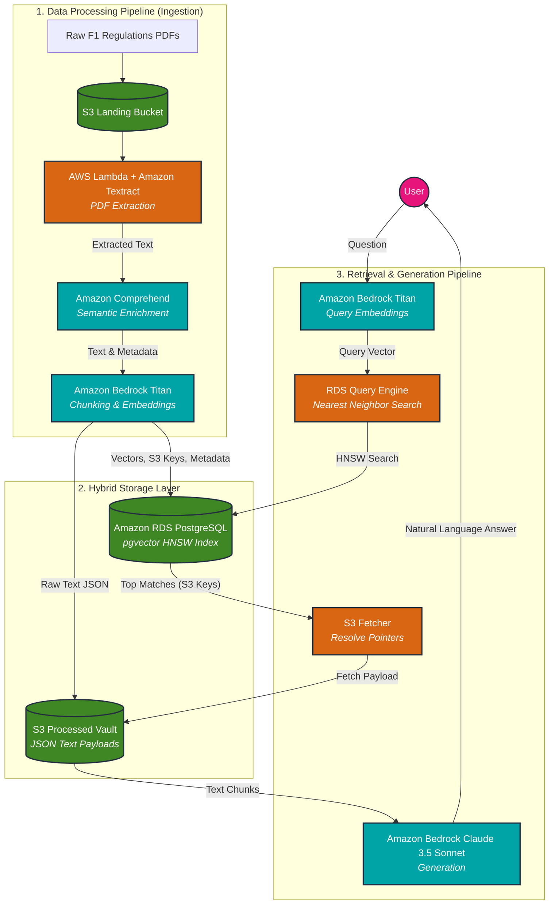

# Formula 1 Regulations RAG Architecture

This document visualizes the architecture outlined in our project idea. It leverages a hybrid storage approach to optimize for both low-latency retrieval and cost-efficiency using AWS services.

## Architecture Diagram

## How It Works

1. **Ingestion Pipeline**: Raw PDFs are dropped into an S3 bucket. A Lambda function triggers Amazon Textract to carefully extract multi-column text and tables without breaking the format. The text is enriched with metadata using Comprehend, embedded using Bedrock Titan, and prepared for storage.
2. **Hybrid Storage**: To save costs on expensive vector database storage, the heavy text payloads are stored as JSON files in a cheap S3 Vault. Only the lightweight mathematical vectors and their corresponding S3 file paths (pointers) are stored in RDS PostgreSQL using the `pgvector` extension.
3. **Retrieval Pipeline**: When a user asks a question, it's embedded into a vector. RDS pgvector quickly finds the nearest neighbors (the most relevant document chunks) and returns their S3 paths. The system fetches the actual text from S3 and passes it to Claude 3.5 Sonnet to generate a precise, context-aware answer.
